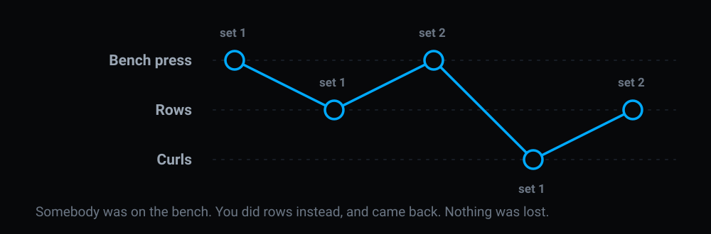
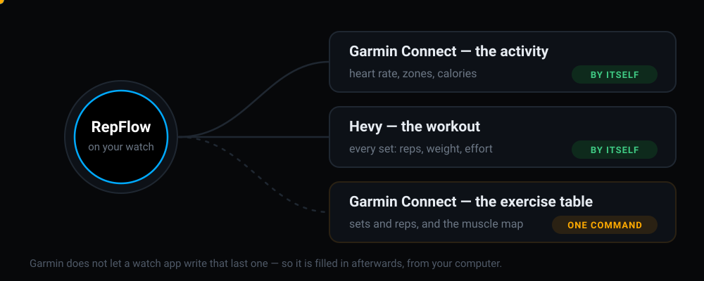

<div align="center">



<br>

[](https://developer.garmin.com/connect-iq/)
[](https://developer.garmin.com/connect-iq/sdk/)
[](docs/DEVICE_MATRIX.md)
[](#hevy)

[](#testing)
[](LICENSE)
[](docs/API_LIMITATIONS.md)
[](CONTRIBUTING.md)

**A Garmin watch app for people who lift in whatever order the gym allows.**

</div>

---

## The problem

You planned bench, then rows, then curls. You get there and somebody is on the
bench for the next twenty minutes.

Your watch does not care. Garmin's own strength mode walks through the workout
in the order it was written, and so does every other strength app on the watch:
do exercise one, then two, then three. Going out of order means fighting the
app — skipping, backing out, losing count, or giving up and typing it into your
phone afterwards.

Real gyms have never worked that way. **RepFlow treats going out of order as
normal, because it is.**

<div align="center">
  
</div>

Pick any exercise at any time. Leave one half-finished and come back to it six
minutes later. Swap a movement for another. Add one that was not in the plan.
Nothing is lost and nothing has to be undone, because the app never assumes
where you are going next.

## How a session goes

<div align="center">
  
</div>

You start the app, pick a workout, and choose whatever you are actually about to
do. You lift. One button says the set is done, and the rest timer starts by
itself. When you are ready you lift again — the same exercise, or a different
one, it makes no difference to the app.

At the end you get a recap: what you lifted, how long it took, what your heart
did, which muscles you worked this week, and anything that was a personal best.

Two buttons carry the whole session. They are the same two Garmin uses on its
own activity screens, so they already mean what your thumb expects:

| While you are lifting | |
|---|---|
| **BACK** | the set is done — start resting |
| **START** | change the weight or reps first |

| While you are resting | |
|---|---|
| **BACK** | rest is over, back to the bar |
| **START** | show me the exercise list |

**UP** and **DOWN** turn the page — heart rate on one, the session's running
totals on another. Holding **UP** opens the menu, where everything else lives.

## Where your workout ends up

<div align="center">
  
</div>

RepFlow records a **real Garmin activity** — strength training, with heart rate,
zones, calories and training effect. It is not a note-taking app pretending to
be a workout; it is in your Garmin history like a run is.

If you use **[Hevy](https://www.hevyapp.com/)**, it works both ways: your
routines come down to the watch before the gym, and the finished session goes
back up on its own when you save it. You never type a set into your phone again.

There is one thing the watch cannot do, and it is Garmin's doing rather than
ours. Garmin Connect shows a strength activity with a table of sets and reps and
a little map of the muscles you worked — and Garmin does not let a watch app
write that table. So RepFlow fills it in afterwards, from your computer, with a
single command, using what it already recorded. The whole investigation is
[written up here](docs/garmin-strength-integration-poc.md), including everything
that does not work and why.

## What it does

| | |
|---|---|
| **Any order** | Pick, defer, resume, substitute or add an exercise mid-session |
| **A real Garmin activity** | `SPORT_TRAINING` + `SUB_SPORT_STRENGTH_TRAINING` — heart rate, zones, calories, training effect |
| **Hevy, both ways** | Import your routines to the watch; your finished session goes back automatically |
| **Garmin's native exercise table** | Sets, reps and loads into the table Connect IQ cannot write itself |
| **Effort (RPE)** | On the scale Hevy's API actually accepts, rated after the set, costing no extra press |
| **Rest, two ways** | A countdown, or a clock that runs until you say stop |
| **Recap** | Totals, physiology, time in zone, per-exercise breakdown, effort chart, records, the week's volume by muscle |

## Screens

<div align="center">

| Set | Rest | Recap |
|:---:|:---:|:---:|
|  |  |  |

</div>

## Hevy

Optional. Without it RepFlow is a complete workout tracker; with it, your
routines and your history move between the two.

Put your API key (Hevy app → Settings → Developer) into RepFlow's settings from
Garmin Connect on your phone, then on the watch: workout list → **MENU** →
**Import from Hevy**.

> **A Hevy key is read *and* write over your entire training history and cannot
> be scoped.** Never commit one anywhere. `make doctor` checks that none has
> been, and `make package` refuses to build a Store bundle while one is present.

---

<div align="center">

### Everything below is for building it

</div>

## Getting started

**You need** the [Connect IQ SDK](https://developer.garmin.com/connect-iq/sdk/)
and a Garmin account to download device definitions. The SDK Manager needs a
signed-in account; there is no way around that.

```sh
git clone <your fork>
cd RepFlow

make bootstrap       # SDK, tooling and a developer signing key
make doctor          # check the environment
make test            # 113 watch tests + 300 backend tests
make sim             # run it in the Connect IQ simulator
```

To put it on a watch, connect it over USB and:

```sh
make sideload DEVICE=fenix6pro
```

`make` on its own lists every command with a one-line description, and
`make devices` lists the device ids your SDK has definitions for.

## The rule the code follows

> **Select any exercise at any time.**

This sequence is ordinary, not a recovery path:

```
A set 1  →  B set 1  →  A set 2  →  C set 1  →  B set 2
```

There is no cursor. `WorkoutEngine` navigates by stable exercise id and nothing
in the codebase increments an index. Defer an occupied machine, come back to it
six minutes later, and the app has not lost a thing.

## The table Connect IQ cannot write

Garmin Connect draws its exercise table, work/rest split and muscle map from FIT
`set` messages, and **Connect IQ cannot write those** — verified three
independent ways against SDK 9.2.0, and asserted in the test suite so it cannot
rot quietly.

So a RepFlow activity arrives native and its table arrives empty.

`backend/` closes that from the other side. It reads the activity Garmin already
stores, pulls the sets back out of the developer fields RepFlow wrote into the
FIT, and writes them into the same activity as native exercise sets — no second
activity, and the heart rate and calories the watch measured stay untouched.

```sh
make sync-garmin     # fill Garmin Connect's exercise table
make sync-hevy       # post the session to Hevy (the watch usually did it already)
```

It runs on your machine when you ask it to. Nothing is scheduled and nothing
listens.

## Architecture

```
Views ──▶ AppController ──▶ WorkoutEngine        (pure: imports only Toybox.Lang)
               ├──▶ RestTimer                    (pure, tick-driven)
               ├──▶ GarminRecorder ──▶ ActivityRecording      (the only file that does)
               ├──▶ SessionRepository ──▶ Application.Storage (the only file that does)
               └──▶ HevySync ──▶ HevyApi ──▶ Hevy REST
```

- `WorkoutEngine` is the **single writer** of exercise state. Its class comment
  lists every legal transition.
- Screens are drawn in code, not from XML layouts, so one path covers 240×240
  through 466×466.
- Navigation is flat: `switchToView` everywhere, never a push/pop stack.

More in [`docs/ARCHITECTURE.md`](docs/ARCHITECTURE.md).

## Testing

```sh
make test            # everything
make test-watch      # Monkey C, in the simulator
make test-backend    # Python, no account needed
```

The watch suite runs in the Connect IQ simulator under Run No Evil. The backend
suite is ordinary pytest: the payload builder, the exercise mapping and the FIT
reader are pure functions, and the FIT fixtures are encoded with **Garmin's own**
Python SDK so the reader is checked against Garmin's definition of the format
rather than against its own assumptions.

`backend/tests/test_watch_contract.py` is the one to read first: it parses the
Monkey C source and the resource XML and fails if the two languages ever stop
agreeing about the developer FIT fields.

## Contributing

Read [`CONTRIBUTING.md`](CONTRIBUTING.md) first — particularly the no-fake-API
rule, which is the one thing this project will not bend on: never invent a
class, method, constant or device id. Verify it against the installed SDK, and
record what you found in [`docs/API_LIMITATIONS.md`](docs/API_LIMITATIONS.md).

## Licence

[GNU General Public License v3.0](LICENSE).

You may use, study, modify and redistribute this. If you distribute a modified
version, you must publish its source under the same licence. That is the point:
improvements come back, and nobody turns this into something closed.

## Acknowledgements

- Garmin's [Connect IQ SDK](https://developer.garmin.com/connect-iq/) and its
  published FIT profile.
- [cyberjunky/python-garminconnect](https://github.com/cyberjunky/python-garminconnect)
  (MIT), from which the Garmin exercise catalogue shipped in `backend/` is
  generated — see `backend/scripts/generate_catalogue.py`.
- [hevy2garmin](https://github.com/intergalacticwiseguy/hevy2garmin), which
  demonstrated that a native strength FIT file can be produced outside the
  watch, and is the reason `docs/garmin-strength-integration-poc.md` reaches the
  conclusion it does.

RepFlow is not affiliated with Garmin or with Hevy.
