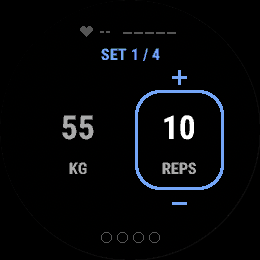
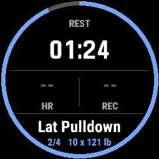
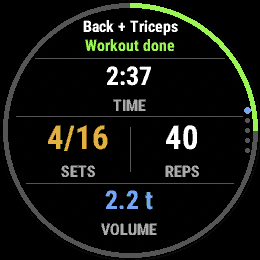

<div align="center">

# RepFlow

**Your workout. Your order.**

A Garmin Connect IQ watch app for people who lift in whatever order the gym allows.

[](LICENSE)
[](https://developer.garmin.com/connect-iq/)
[](docs/DEVICE_MATRIX.md)
[](#testing)

</div>

---

## The problem

Garmin's own strength mode makes you follow the workout in the order it was
written. Real gyms do not work that way. The bench is taken, so you do rows
first. The cable station has a queue, so you come back to it. Someone is curling
in the squat rack.

Every strength app on the watch treats that as an exception. RepFlow treats it as
the normal case.

## The rule everything follows

> **Select any exercise at any time.**

This sequence is ordinary, not a recovery path:

```
A set 1  →  B set 1  →  A set 2  →  C set 1  →  B set 2
```

There is no cursor. `WorkoutEngine` navigates by stable exercise id and nothing
in the codebase increments an index. Defer an occupied machine, come back to it
six minutes later, and the app has not lost a thing.

## What it does

| | |
|---|---|
| **Any order** | Pick, defer, resume, substitute or add an exercise mid-session |
| **Records a real Garmin activity** | `SPORT_TRAINING` + `SUB_SPORT_STRENGTH_TRAINING` — heart rate, zones, calories, training effect |
| **Hevy, both ways** | Import your routines to the watch; your finished session goes back automatically |
| **Fills Garmin's native exercise table** | Sets, reps and loads into the table Connect IQ cannot write itself — see [below](#the-table-connect-iq-cannot-write) |
| **RPE** | On the scale Hevy's API actually accepts, rated after the set, costing no extra press |
| **Rest, two ways** | A countdown, or a clock that runs until you say stop |
| **Recap** | Totals, physiology, time in zone, per-exercise breakdown, effort chart, records, the week's volume by muscle |

## Screens

<div align="center">

| Set | Rest | Recap |
|:---:|:---:|:---:|
|  |  |  |

</div>

## Buttons

They follow the watch's own activity screens rather than inventing a scheme.
During an activity on a Garmin, **BACK is the LAP button** and LAP means "that
piece is done".

| Screen | BACK | START | UP / DOWN | MENU |
|---|---|---|---|---|
| Exercise | log the set | open the set to adjust it first | data screens | exercise list, edit, end… |
| Rest | rest is over | exercise list | data screens | exercise list, rest mode, ±15 s… |
| Exercise list | back where you came from | choose | scroll | — |

## The table Connect IQ cannot write

Garmin Connect shows a strength activity with an exercise table, a work/rest
split and a muscle map. All of it is drawn from FIT `set` messages, and
**Connect IQ cannot write those** — verified three independent ways against SDK
9.2.0, and asserted in the test suite so it cannot rot quietly.

So a RepFlow activity arrives native and its table arrives empty.

`backend/` closes that from the other side. It reads the activity Garmin already
stores, pulls the sets back out of the developer fields RepFlow wrote into the
FIT, and writes them into the same activity as native exercise sets — no second
activity, and the heart rate and calories the watch measured stay untouched.

```sh
make sync-garmin     # fill Garmin Connect's exercise table
make sync-hevy       # post the session to Hevy (the watch usually did it already)
```

It runs on your machine when you ask it to. Nothing is scheduled and nothing
listens. The full investigation, including what does not work and why, is in
[`docs/garmin-strength-integration-poc.md`](docs/garmin-strength-integration-poc.md).

## Getting started

**You need** the [Connect IQ SDK](https://developer.garmin.com/connect-iq/sdk/)
and a Garmin account to download device definitions. The SDK Manager needs a
signed-in account; there is no way around that.

```sh
git clone <your fork>
cd RepFlow

make bootstrap       # SDK, tooling and a developer signing key
make doctor          # check the environment
make test            # 109 watch tests + 300 backend tests
make sim             # run it in the Connect IQ simulator
```

To put it on a watch, connect it over USB and:

```sh
make sideload DEVICE=fenix6pro
```

`make devices` lists the device ids your SDK has definitions for.

## Hevy

Optional. Without it RepFlow is a complete workout tracker; with it, your
routines and your history move between the two.

Put your API key (Hevy app → Settings → Developer) into the app's settings from
Garmin Connect on your phone, then on the watch: workout list → **MENU** →
**Import from Hevy**.

> **A key is read *and* write over your entire training history and cannot be
> scoped.** Never commit one. `make doctor` checks that none has been, and
> `make package` refuses to build a Store bundle while one is present.

## Architecture

```
Views ──▶ AppController ──▶ WorkoutEngine        (pure: imports only Toybox.Lang)
               ├──▶ RestTimer                    (pure, tick-driven)
               ├──▶ GarminRecorder ──▶ ActivityRecording      (the only file that does)
               ├──▶ SessionRepository ──▶ Application.Storage (the only file that does)
               └──▶ HevySync ──▶ HevyApi ──▶ Hevy REST
```

- `WorkoutEngine` is the **single writer** of exercise state. Its class comment
  lists every legal transition.
- Screens are drawn in code, not from XML layouts, so one path covers 240×240
  through 466×466.
- Navigation is flat: `switchToView` everywhere, never a push/pop stack.

More in [`docs/ARCHITECTURE.md`](docs/ARCHITECTURE.md).

## Testing

```sh
make test            # everything
make test-watch      # Monkey C, in the simulator
make test-backend    # Python, no account needed
```

The watch suite runs in the Connect IQ simulator under Run No Evil. The backend
suite is ordinary pytest: the payload builder, the exercise mapping and the FIT
reader are pure functions, and the FIT fixtures are encoded with **Garmin's own**
Python SDK so the reader is checked against Garmin's definition of the format
rather than against its own assumptions.

`backend/tests/test_watch_contract.py` is the one to read first: it parses the
Monkey C source and the resource XML and fails if the two languages ever stop
agreeing about the developer FIT fields.

## Contributing

Read [`CONTRIBUTING.md`](CONTRIBUTING.md) first — particularly the no-fake-API
rule, which is the one thing this project will not bend on: never invent a
class, method, constant or device id. Verify it against the installed SDK, and
record what you found in [`docs/API_LIMITATIONS.md`](docs/API_LIMITATIONS.md).

## Licence

[GNU General Public License v3.0](LICENSE).

You may use, study, modify and redistribute this. If you distribute a modified
version, you must publish its source under the same licence. That is the point:
improvements come back, and nobody turns this into something closed.

## Acknowledgements

- Garmin's [Connect IQ SDK](https://developer.garmin.com/connect-iq/) and its
  published FIT profile.
- [cyberjunky/python-garminconnect](https://github.com/cyberjunky/python-garminconnect)
  (MIT), from which the Garmin exercise catalogue shipped in `backend/` is
  generated — see `backend/scripts/generate_catalogue.py`.
- [hevy2garmin](https://github.com/intergalacticwiseguy/hevy2garmin), which
  demonstrated that a native strength FIT file can be produced outside the
  watch, and is the reason `docs/garmin-strength-integration-poc.md` reaches the
  conclusion it does.

RepFlow is not affiliated with Garmin or with Hevy.
